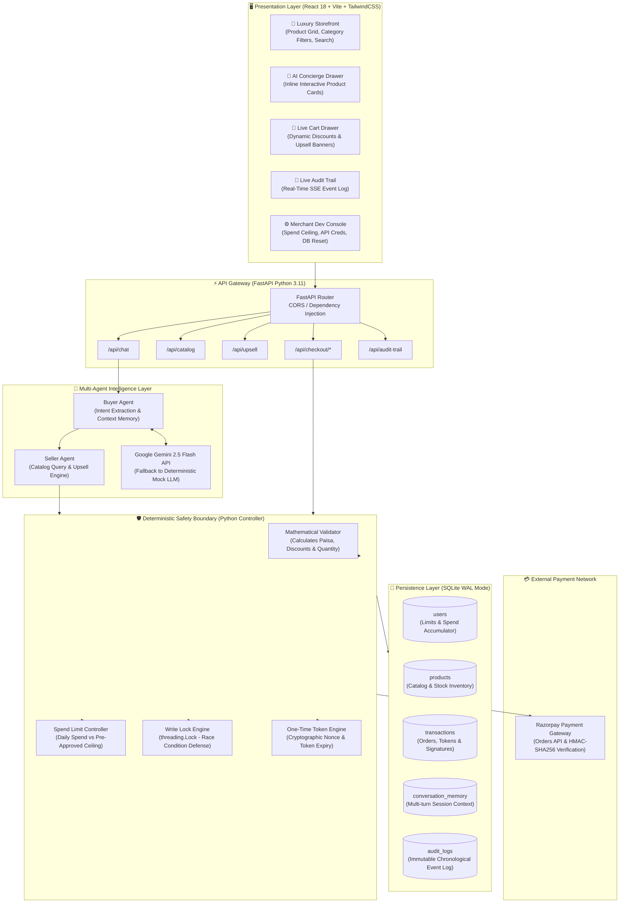
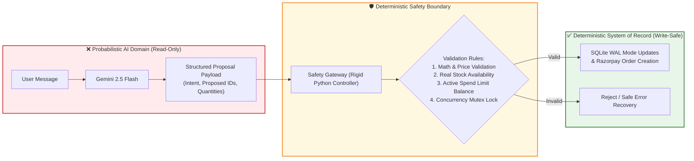
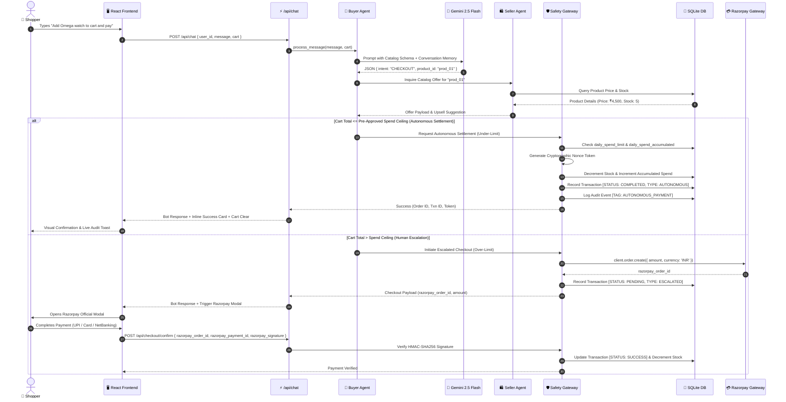
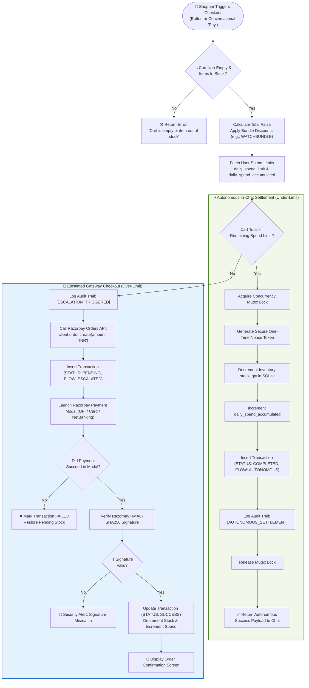
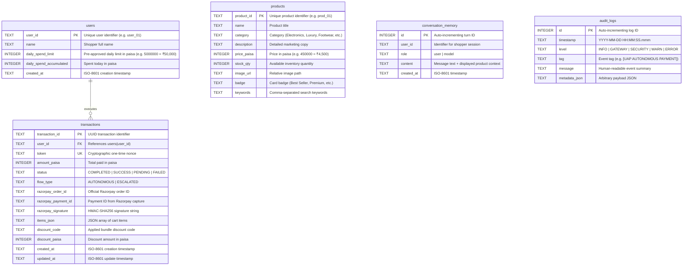

# 💳 Razorpay Agentic Commerce Portal
### *Autonomous Conversational Commerce & Machine-to-Machine Settlement Protocol*

[](https://fastapi.tiangolo.com)
[](https://react.dev)
[](https://tailwindcss.com)
[](https://razorpay.com)
[](https://ai.google.dev)
[](https://www.sqlite.org)
[](https://python.org)

---

## 🌟 Executive Overview

The **Razorpay Agentic Commerce Portal** is an autonomous e-commerce engine designed for **Track 1 (AI Growth & Agentic Commerce)** of the **Razorpay AI Buildathon**.

Traditional conversational commerce suffers from high friction: chatbots merely recommend links, leaving customers to manually navigate carts, apply discount codes, and pass through multiple checkout screens. The **Agentic Commerce Portal** changes this paradigm by combining a full-featured luxury storefront with an **Autonomous Multi-Agent Settlement Protocol**:

1. **Buyer Agent (Shopping Concierge)** parses shopper intent, searches the catalog semantically, retains multi-turn context memory, and recommends curated products rendered directly as inline interactive cards inside chat bubbles.
2. **Seller Agent (Merchant Representative)** evaluates active carts, generates contextual upsells, and negotiates bundle discounts dynamically (e.g., `WATCHBUNDLE`, `DESKSETUP`).
3. **Deterministic Safety Boundary & Gateway** guarantees financial integrity: probabilistic LLMs are strictly isolated from direct write access to database records and payment APIs.
4. **Autonomous In-Chat Settlement vs. Escalation**: Orders under the customer's pre-approved daily spend limit (inspired by NPCI's Unified Autonomous Payment protocol) execute autonomously inside the chat in under 800ms. High-value orders seamlessly escalate to Razorpay's official checkout modal.

---

## 🏛️ High-Level System Architecture (HLD)

The architecture strictly separates probabilistic AI inference from deterministic transaction processing:



---

## 🛡️ The Deterministic Safety Boundary

In production fintech systems, probabilistic Large Language Models (LLMs) hallucinate and loop. Granting an LLM direct write permissions to databases or payment gateway APIs introduces critical security risks.

Our system enforces the **Deterministic Safety Boundary**:



1. **Purely Read-Only AI Layer:** The Buyer and Seller Agents cannot modify database tables, alter user balances, or execute payments directly.
2. **Rigid Math Verification:** The Python Gateway recalculates item prices, line items, and discount coupons in `paisa` using integer arithmetic to prevent floating-point rounding errors.
3. **Atomic Concurrency Locks:** Threading locks prevent race conditions, double-spending, and stock overselling during simultaneous requests.

---

## 🔄 End-to-End Data Flow Diagram (DFD)

The data flow below captures the lifecycle of a conversational request through semantic parsing, cart management, and financial settlement:



---

## 🔀 Decision Flow Chart: Autonomous vs. Escalated Checkout

The core transactional logic governing the **Deterministic Safety Boundary**:



---

## 🗄️ Database Architecture (Entity Relationship Diagram)

Configured in **SQLite Write-Ahead Logging (WAL)** mode for high-concurrency non-blocking reads during writes:



---

## 🚀 Key Features

| Feature | Description |
| :--- | :--- |
| **🛍️ Luxury Amazon-Style Storefront** | Polished responsive catalog featuring product sliders, category tabs, badges, stock counters, and real-time query search. |
| **💬 AI Shopping Concierge** | Slide-out chatbot drawer featuring multi-turn conversation memory, semantic product matchmaking, and interactive in-chat product cards with instant "Add to Cart" actions. |
| **⚡ Autonomous In-Chat Settlement** | Under-limit purchases execute automatically in under 800ms upon conversational intent (e.g., *"buy this"*, *"make payment"*). |
| **🔐 Razorpay Escalated Checkout** | High-value transactions automatically trigger Razorpay's checkout modal with full HMAC-SHA256 webhook/signature validation. |
| **🎯 Dynamic Multi-Agent Upselling** | Seller Agent intercepts cart modifications and pitches personalized companion items with bundle discount codes (`WATCHBUNDLE`, `DESKSETUP`). |
| **🛡️ NPCI UAP Spend Ceilings** | Configurable daily spend limit (`daily_spend_limit`) prevents unauthorized bulk spending. Real-time balance meters display available headroom. |
| **📜 Live Visual Audit Trail** | Millisecond-accurate event log tracking agent decisions, risk scoring, state changes, and transaction hashes. |
| **⚙️ Developer Control Center** | Interactive modal to adjust spend limits, test offline fallback modes, inspect system health, and re-seed the database. |

---

## 📡 API Reference

| Method | Endpoint | Description |
| :--- | :--- | :--- |
| `GET` | `/api/catalog` | Fetch product catalog with optional `?category=` filter. |
| `GET` | `/api/catalog/{product_id}` | Fetch individual product specifications and stock status. |
| `GET` | `/api/user` | Retrieve user state, daily spend limit, and remaining headroom. |
| `POST` | `/api/user/limit` | Update user daily spend limit (`daily_spend_limit`). |
| `POST` | `/api/chat` | Send shopper message to Buyer Agent; returns recommendations and checkout payloads. |
| `POST` | `/api/upsell` | Query Seller Agent for cross-sell recommendations and bundle discount codes. |
| `POST` | `/api/checkout/initiate` | Evaluate cart and route to either autonomous or escalated flow. |
| `POST` | `/api/checkout/autonomous` | Execute autonomous payment for pre-approved under-limit carts. |
| `POST` | `/api/checkout/confirm` | Verify Razorpay HMAC-SHA256 signature for escalated transactions. |
| `GET` | `/api/orders` | Retrieve order history for the active user. |
| `GET` | `/api/audit-trail` | Stream or query the chronological security and agent audit logs. |
| `POST` | `/api/memory/clear` | Clear multi-turn conversational memory for a user. |
| `POST` | `/api/reset-db` | Reset database tables and re-seed products to default state. |

---

## 🛠️ Installation & Local Setup

### Prerequisites
- **Python 3.11+**
- **Node.js 18+** & **npm**

---

### Step 1: Clone the Repository
```bash
git clone https://github.com/krishna016agarwal/Agentic_Commerce.git
cd Agentic_Commerce
```

---

### Step 2: Backend Setup
The backend utilizes a dedicated Python virtual environment.

```powershell
# Navigate to backend
cd backend

# Create virtual environment
python -m venv venv

# Activate virtual environment
# Windows PowerShell:
.\venv\Scripts\Activate.ps1
# macOS / Linux:
# source venv/bin/activate

# Install all backend dependencies
pip install -r requirements.txt
```

#### Configure Environment Variables (`backend/.env`):
Create a `.env` file in the `backend/` directory:
```ini
# Google Gemini API Key (Optional: system provides deterministic mock fallback if empty)
GEMINI_API_KEY=your_gemini_api_key_here

# Razorpay Test Mode Credentials
RAZORPAY_KEY_ID=rzp_test_TWl4eo89k3aLud
RAZORPAY_KEY_SECRET=TnA2AVvCQ5Ys6gdmVHHYLJ72
```

#### Run Backend Server:
```powershell
uvicorn main:app --reload --port 8000
```
Backend API will be live at: `http://localhost:8000`  
Swagger API Docs available at: `http://localhost:8000/docs`

---

### Step 3: Frontend Setup
In a new terminal window:

```powershell
# Navigate to frontend
cd frontend

# Install Node dependencies
npm install

# Start Vite Development Server
npm run dev
```
Frontend will be live at: `http://localhost:5173`

---

### Step 4: Run Automated Tests
Execute the backend test suite inside the virtual environment:
```powershell
cd backend
.\venv\Scripts\pytest.exe test_suite.py -v
```
All **10 core fintech integration tests** validate:
- Product catalog retrieval and stock validation.
- User spend limit calculations and remaining headroom.
- Autonomous checkout under-limit approval.
- Escalated checkout over-limit routing.
- Razorpay signature verification and tamper detection.
- Multi-turn conversation memory persistence.
- Concurrency write locks and inventory protection.

---

## 🔒 Security & Compliance Safeguards

1. **Zero Key Exposure:** API keys (`GEMINI_API_KEY`, `RAZORPAY_KEY_SECRET`) are strictly maintained on the backend server (`.env`) and never exposed in frontend client bundles.
2. **Cryptographic Nonce Validation:** Autonomous transactions generate single-use cryptographic tokens (`secrets.token_hex(16)`) to prevent replay attacks.
3. **HMAC-SHA256 Signature Verification:** Escalated Razorpay transactions are cryptographically verified using `razorpay.utility.verify_payment_signature`.
4. **Integer Arithmetic:** All currency amounts are calculated strictly in `paisa` (integer) to avoid floating-point inaccuracies.
5. **Immutable Audit Trail:** All state-changing events (limit adjustments, agent proposals, transaction completions, signature failures) are permanently logged with microsecond timestamps in `audit_logs`.

---

## 👥 Contributors & Acknowledgements

- Built for the **Razorpay AI Buildathon — Track 1: AI Growth & Agentic Commerce**.
- Architecture inspired by **NPCI Unified Autonomous Payment (UAP)** and **Agentic Commerce Protocols (ACP)**.
