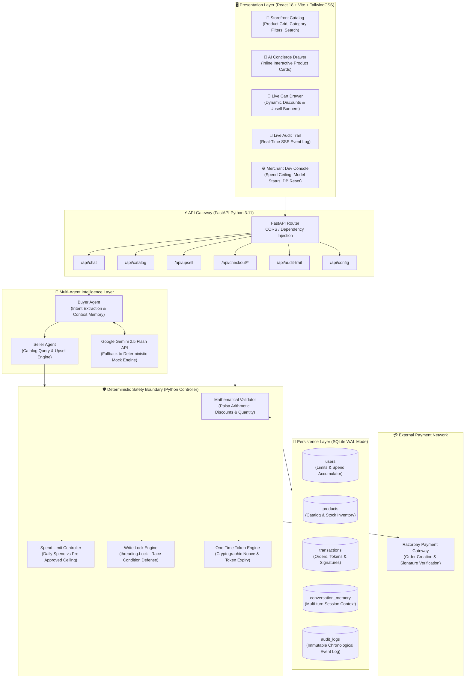
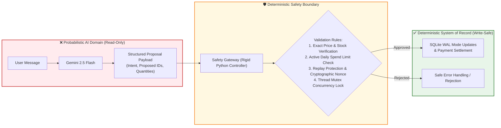
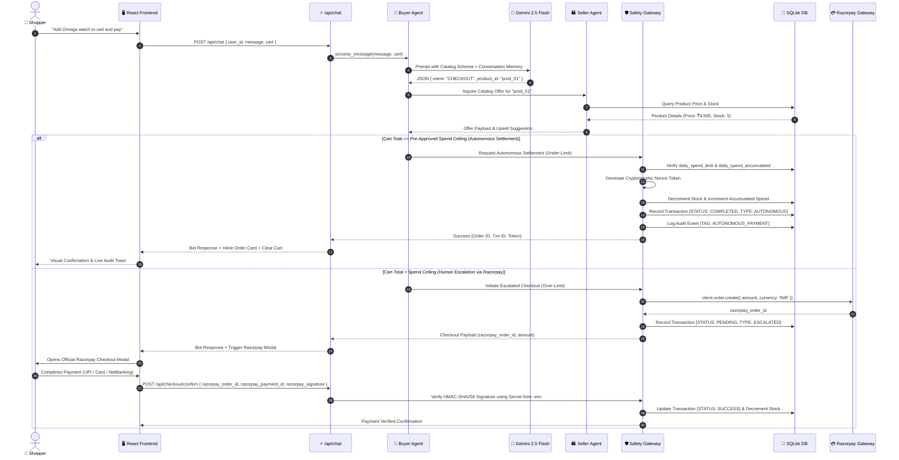
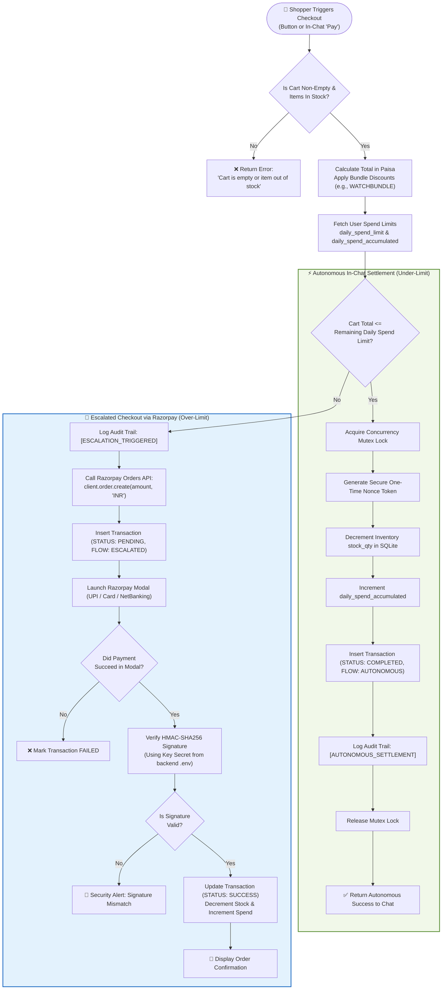
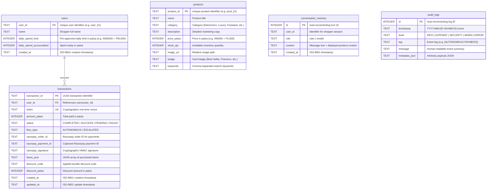

# 🛍️ Agentic Commerce Portal
### *Autonomous Conversational Commerce & Machine-to-Machine Agent Settlement*
*(Payments processed securely via Razorpay)*

[](https://fastapi.tiangolo.com)
[](https://react.dev)
[](https://tailwindcss.com)
[](https://razorpay.com)
[](https://ai.google.dev)
[](https://www.sqlite.org)
[](https://python.org)

---

## 🌟 Overview

The **Agentic Commerce Portal** is an autonomous full-stack e-commerce platform that combines a modern storefront with a **Multi-Agent Conversational Settlement Protocol**. Razorpay is integrated strictly as the underlying payment gateway for handling secure checkout and signature verification.

Traditional e-commerce chatbots typically act as basic question-answering assistants that provide hyperlinks, requiring customers to manually navigate carts, apply discount codes, and complete checkout. The **Agentic Commerce Portal** transforms this workflow into an autonomous, agent-driven shopping experience:

1. **Buyer Agent (Shopping Concierge):** Parses user intent in natural language, searches the product catalog semantically, maintains multi-turn conversation memory, and returns interactive product cards directly inside chat bubbles.
2. **Seller Agent (Merchant Representative):** Monitors active cart updates, computes dynamic contextual upsell recommendations, and applies bundle discounts (e.g., `WATCHBUNDLE`, `DESKSETUP`).
3. **Deterministic Safety Boundary:** Strictly isolates probabilistic AI reasoning from direct write permissions to databases and payment endpoints.
4. **Autonomous In-Chat Settlement vs. Escalation:**
   - **Under-Limit Orders:** Cart totals within the customer's pre-approved daily spend limit execute autonomously in-chat using a single-use cryptographic token in under 800ms.
   - **Over-Limit Orders:** High-value transactions gracefully escalate to Razorpay's official checkout window for human authorization and cryptographic HMAC-SHA256 signature verification.

---

## 🏛️ High-Level System Architecture (HLD)

The architecture strictly separates probabilistic AI inference from deterministic transaction processing:



---

## 🛡️ The Deterministic Safety Boundary

In financial systems, probabilistic Large Language Models (LLMs) must **never** have direct write access to database tables or directly invoke payment gateways.

The **Agentic Commerce Portal** enforces a rigid **Deterministic Safety Boundary**:



- **Read-Only AI Domain:** AI models only propose actions; they cannot directly commit database modifications or trigger transactions.
- **Integer Paisa Math:** Currency computations use integer `paisa` values to completely eliminate floating-point rounding errors.
- **Concurrency Mutex Locks:** In-memory threading mutexes protect against race conditions, preventing double-checkout and inventory overselling.

---

## 🔄 End-to-End Data Flow Diagram (DFD)

The sequence below illustrates the flow from shopper inquiry through agent processing, safety validation, and settlement:



---

## 🔀 Decision Flow Chart: Autonomous vs. Escalated Checkout



---

## 🗄️ Database Schema (Entity Relationship Diagram)

Configured with **SQLite Write-Ahead Logging (WAL)** for high-throughput concurrent reads and writes:



---

## 🚀 Key Features

| Feature | Description |
| :--- | :--- |
| **🛍️ Modern Storefront** | Product catalog featuring category navigation, search filtering, inventory stock meters, and promotional badges. |
| **💬 AI Shopping Concierge** | Slide-out chatbot drawer with multi-turn conversation memory, semantic product matchmaking, and interactive in-chat product cards. |
| **⚡ Autonomous Settlement** | Transactions within the customer's daily spend limit execute automatically in-chat in under 800ms. |
| **🔐 Razorpay Payment Gateway** | High-value transactions route seamlessly through Razorpay's official checkout modal with backend signature verification. |
| **🎯 Dynamic Upselling** | Seller Agent analyzes cart additions and suggests companion products with bundle discounts (`WATCHBUNDLE`, `DESKSETUP`). |
| **🛡️ Spending Ceilings** | Configurable daily spend limit prevents unauthorized high-value spending with real-time headroom tracking. |
| **📜 Live Visual Audit Trail** | Microsecond-accurate event log recording agent inferences, risk scoring, state changes, and transaction records. |
| **⚙️ Developer Console** | Management modal to inspect system health, adjust spend ceilings, view model connectivity, and re-seed catalog data. |

---

## 📡 REST API Reference

| Method | Endpoint | Description |
| :--- | :--- | :--- |
| `GET` | `/api/catalog` | Retrieve product catalog with optional `?category=` filter. |
| `GET` | `/api/catalog/{product_id}` | Retrieve individual product specifications and inventory status. |
| `GET` | `/api/user` | Retrieve shopper details, daily spend limit, and remaining spend allowance. |
| `POST` | `/api/user/limit` | Update user daily spend limit (`daily_spend_limit`). |
| `POST` | `/api/chat` | Send shopper message to Buyer Agent; returns recommendations and checkout proposals. |
| `POST` | `/api/upsell` | Query Seller Agent for companion recommendations and bundle discount codes. |
| `POST` | `/api/checkout/initiate` | Evaluate cart and route to either autonomous or escalated flow. |
| `POST` | `/api/checkout/autonomous` | Execute autonomous settlement for pre-approved under-limit orders. |
| `POST` | `/api/checkout/confirm` | Cryptographically verify Razorpay payment signature for escalated transactions. |
| `GET` | `/api/orders` | Retrieve order and transaction history for the active user. |
| `GET` | `/api/audit-trail` | Stream or query chronological security and agent audit logs. |
| `GET` | `/api/config` | Retrieve non-sensitive public configuration (public Key ID; secrets never exposed). |
| `POST` | `/api/memory/clear` | Reset multi-turn conversational memory for a user session. |
| `POST` | `/api/reset-db` | Reset database tables and re-seed default catalog data. |

---

## 🛠️ Installation & Local Setup

### Prerequisites
- **Python 3.11+**
- **Node.js 18+** & **npm**

---

### Step 1: Clone the Repository
```bash
git clone https://github.com/krishna016agarwal/Agentic_Commerce.git
cd Agentic_Commerce
```

---

### Step 2: Backend Setup
The backend runs within a dedicated Python virtual environment.

```powershell
# Navigate to backend directory
cd backend

# Create virtual environment (if not already created)
python -m venv venv

# Activate virtual environment
# Windows PowerShell:
.\venv\Scripts\Activate.ps1
# macOS / Linux:
# source venv/bin/activate

# Install required dependencies
pip install -r requirements.txt
```

#### Configure Environment Variables (`backend/.env`):
Create or update `backend/.env` (this file is excluded from Git via `.gitignore`):
```ini
# Google Gemini API Key (Optional: system provides an offline mock fallback if empty)
GEMINI_API_KEY=your_gemini_api_key_here

# Razorpay API Credentials (Backend server use only - NEVER exposed on frontend)
RAZORPAY_KEY_ID=your_razorpay_key_id_here
RAZORPAY_KEY_SECRET=your_razorpay_key_secret_here
```

#### Run Backend Server:
```powershell
uvicorn main:app --reload --port 8000
```
- API Base URL: `http://localhost:8000`  
- Interactive Swagger Documentation: `http://localhost:8000/docs`

---

### Step 3: Frontend Setup
In a separate terminal window:

```powershell
# Navigate to frontend directory
cd frontend

# Install Node packages
npm install

# Start Vite development server
npm run dev
```
- Frontend Application URL: `http://localhost:5173`

---

### Step 4: Run Automated Tests
Execute the backend test suite inside the virtual environment:
```powershell
cd backend
.\venv\Scripts\pytest.exe test_suite.py -v
```

All **10 integration tests** validate:
- Catalog retrieval and inventory stock deduction.
- User spend limit calculations and remaining headroom.
- Autonomous checkout under-limit approval and token generation.
- Escalated checkout over-limit routing to Razorpay.
- Razorpay HMAC-SHA256 signature verification and tamper prevention.
- Multi-turn conversation memory persistence.
- Concurrency write locks and double-spend protection.

---

## 🔒 Security & Credential Protection

1. **Zero Secret Key Exposure:** Payment gateway secret keys (`RAZORPAY_KEY_SECRET`) are strictly maintained on the backend in `backend/.env` and are **never** bundled or transmitted to the frontend browser.
2. **Cryptographic Nonces:** Autonomous transactions utilize single-use tokens (`secrets.token_hex(16)`) to safeguard against replay attacks.
3. **HMAC-SHA256 Signature Verification:** Escalated transactions are validated on the backend using `razorpay.utility.verify_payment_signature` to prevent client-side payment tampering.
4. **Integer Currency Arithmetic:** Financial calculations are performed strictly in `paisa` (integer) to avoid floating-point errors.
5. **Immutable Audit Logs:** State modifications, spending ceiling updates, and transaction events are recorded with millisecond timestamps in the `audit_logs` table.
